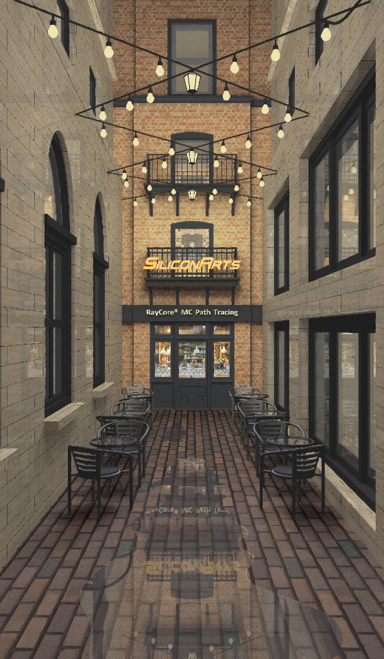

## Introduction
RayCore MC is a real-time path tracing GPU IP Core. Its path tracing and soft shadow techniques present the highest quality photo-realistic images in 3D graphics processing today for real-time applications.
RayCore MC IP core supports advanced graphic effects such as global illumination, soft shadow, depth of field, glossy reflection, and motion blur. Its Multiple-Instruction, Multiple-Data (MIMD) architecture enables real-time render processing and is highly optimized for low power consumption.
As an Intel Gold partner, we provide you with a ray tracing GPU solution that has RayCore MC integrated into Intel Arria 10 FPGA. 

 | 

## Requirement

- OS: Ubuntu 18.04.5
- Compiler: GCC 8.4.0
- Hardware device: Intel® Arria® 10 FPGA or Intel® Arria® 10 PAC

## Build
1. Clone the repository.
2. Install the X11 library.
3. Make a directory named linux_x64 in the app/lib directory
4. Run the build.sh script.
```
git clone https://github.com/siliconarts/RCMC.git
mkdir ./app/lib/linux_x64
sh build.sh
```

## Usage 
1. Follow the instruction in the "RayCore® MC Dev Kit Quick Start Guide.pdf" file in the "doc" directory to set up the FPGA hardware.
2. Download [scene.zip](https://drive.google.com/file/d/1T0YQFlnPm5GfwsBhCuofElV-MbpZj3ZF/view?usp=sharing), and uncompress the zip file to the "bin" directory.
3. Run demos		
	```
	# At the root of the repository
	cd bin
	./rc_museum
	```		
4. If you want to create your own samples, you can refer to other documents in the "doc" directory.

## License
See [License](License)
